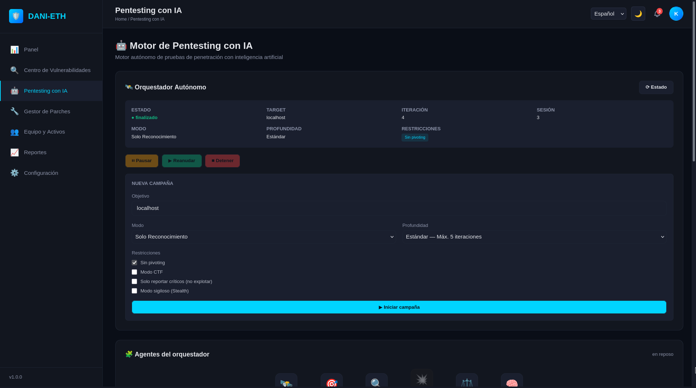

# Dani-ETH

Orquestador autónomo de ethical hacking con IA (Multi-Agent System) que ejecuta pentests en modalidad black box sobre infraestructuras digitales autorizadas.



---

## Requisitos

- **Python 3.11+**
- **API key de DeepSeek** (variable `Deepseek` en `.env`)
- **El runner corriendo** — servicio externo que ejecuta las herramientas:
  - Tool Registry en `http://127.0.0.1:8003`
  - Tool Executor en `http://127.0.0.1:8004`

> El orquestador **no ejecuta herramientas localmente**: se las pide por HTTP al runner. Si el runner no está arriba, no hay ejecución.

---

## Cómo ejecutar

### 1. Instalación

```bash
git clone https://github.com/SimuladorDeFarm/dani-eth.git
cd dani-eth

python3 -m venv .venv
source .venv/bin/activate
pip install -r requirements.txt
```

### 1.1 Configurar el entorno

Copiá el archivo de ejemplo a `.env` y completá la API key de DeepSeek:

```bash
cp .env.example .env     # luego editá .env y agregá tu API key de DeepSeek
```

> El `.env` está en `.gitignore` (no se sube). `.env.example` es la plantilla versionada con todas las variables.

### 2. Levantar la API

> ⚠️ Levantar **desde `orchestrator/`** (no desde la raíz, o los endpoints `/campaign` darán 404).

```bash
cd orchestrator
uvicorn main:app --reload        # docs interactivas: http://127.0.0.1:8000/docs
```

### 3. Definir y lanzar la campaña

La **misión se construye automáticamente** desde los parámetros del `POST /campaign/start`
(`modo` + `profundidad` + `restricciones`) mediante `construir_mision()`. En el flujo normal
**no se edita ningún archivo**: la misión sale del cuerpo de la petición.

> `orchestrator/objetivo.txt` existe solo como *fallback* manual (lo lee la función deprecada
> `cargar_objetivo()`); el flujo por API no lo usa.

```bash
# Ejemplo de inicio:
curl -X POST http://127.0.0.1:8000/campaign/start \
  -H "Content-Type: application/json" \
  -d '{
        "target": "scanme.nmap.org",
        "modo": "solo_reconocimiento",
        "profundidad": "estandar",
        "restricciones": {"modo_ctf": false},
        "sesion_id": 3
      }'
```

- `modo` ∈ `solo_reconocimiento` · `reconocimiento_vulnerabilidades` · `reconocimiento_explotacion`
- `profundidad` ∈ `superficial` · `estandar` · `exhaustivo`

El flujo genera automáticamente un reporte markdown en
`orchestrator/reports/reporte_YYYY-MM-DD_HH-MM-SS.md` (con un `.json` hermano de metadatos)
y un reporte de métricas en `orchestrator/metrics/<timestamp>/`.

### 4. Controlar la campaña (endpoints)

| Método | Ruta | Acción |
|---|---|---|
| POST | `/campaign/start` | Inicia la campaña. Body: `{target, modo, profundidad, restricciones, sesion_id?}` |
| POST | `/campaign/pause` | Pausa (toma efecto en el próximo checkpoint entre tareas) |
| POST | `/campaign/resume` | Reanuda |
| POST | `/campaign/stop` | Detiene la campaña y **genera un reporte parcial** con lo hallado |
| GET | `/campaign/status` | Estado actual (`estado`, `target`, `iteracion_actual`, `ruta_reporte`, …) |
| GET | `/campaign/logs?desde=N` | Eventos para el frontend (cursor incremental) |
| GET | `/campaign/reports` | Lista de reportes ejecutivos generados |
| GET | `/campaign/reports/{id}` | Contenido markdown de un reporte |

Detalle del contrato en [`Docs/endpoints.md`](Docs/endpoints.md).

### Alternativa por CLI

Corre una campaña con el `TARGET` por defecto de `agents/explorer.py`:

```bash
cd orchestrator
python3 -m agents.explorer
```

---

## Variables de entorno

Ver la plantilla completa en [`.env.example`](.env.example):

```env
Deepseek=sk-...                                          # requerida
RUNNER_REGISTRY_URL=http://127.0.0.1:8003               # opcional (default)
RUNNER_EXECUTOR_URL=http://127.0.0.1:8004               # opcional (default)
SESION_ID=3                                             # opcional (sesión del runner)
CORS_ORIGINS=http://localhost:5173,http://127.0.0.1:5173 # opcional (orígenes del frontend)
```

---

## Arquitectura de agentes (MAS)

Cada agente es una instancia de la API de DeepSeek con un system prompt propio. La ejecución de herramientas se delega al runner HTTP.

```
BaseAgent                  → historial, preguntar() genérico
  ├── IterableAgent        → + decidir_iteracion()
  │     ├── ExplorerAgent  → memoria (KB) + summarizer, ejecuta vía runner, planifica tareas
  │     └── ExploiterAgent → misma base iterable, parte de la KB de la exploración
  ├── CommanderAgent       → decidir_fase(): dirige la secuencia de fases del MAS
  ├── JudgeAgent           → + aprueba, evaluar_reporte()
  ├── SummarizerAgent      → actualizar_memoria(): mantiene la KB del Explorador
  └── SelectorAgent        → seleccionar(): elige el pool de herramientas por rol

ReporterAgent(BaseAgent)   → generar_reporte(), guarda .md en reports/
```

- **CommanderAgent** (coordinación): **punto de entrada del MAS** (`dirigir_campaña()`). En cada paso elige la siguiente fase (`decidir_fase`) o cierra la campaña; no ejecuta herramientas, solo dirige. Si la exploración no halló vectores, no asigna la explotación.
- **ExplorerAgent** (reconocimiento): ejecuta herramientas con parámetros estructurados vía runner; mantiene una **memoria de trabajo estructurada (KB)** en vez de arrastrar todo el transcript (ahorra tokens). El output crudo se guarda aparte, fuera del contexto del LLM.
- **ExploiterAgent** (explotación): misma base iterable que el Explorer pero **sin escaneo inicial**; parte de la KB de la exploración e intenta comprometer el objetivo / capturar flags. Solo corre si el Commander asigna la fase.
- **SummarizerAgent**: integra el resultado de cada comando en la KB `{servicios, rutas, archivos, flags, hallazgos, pendientes, descartado}`, copiando verbatim flags/paths/versiones.
- **SelectorAgent**: dado el catálogo del runner, elige el subconjunto de herramientas pertinente al rol (`reconocimiento`, `explotación`). Lo usa cualquier agente que lance comandos.
- **JudgeAgent**: evalúa el reporte de cada iteración contra la misión; aprueba o rechaza.
- **ReporterAgent**: sintetiza el reporte ejecutivo final.

### Flujo de ejecución

```
POST /campaign/start → construir_mision() → CampaignManager (hilo de fondo) → run_campaign()
  └── dirigir_campaña(): el Commander crea el reportador + registro de fases
  └── loop del Commander (decidir_fase): mientras queden fases útiles
        ── FASE EXPLORACIÓN:
             crear_explorador(): Selector elige pool + Summarizer + memoria(target)
             loop (hasta que el Juez apruebe o máx. iteraciones):
               FASE 1 — planificar tareas (nmap inicial en la 1ª iteración)
               FASE 2 — ejecutar cada tarea en el runner → la memoria (KB) se actualiza
               FASE 3 — reporte markdown de la iteración (desde la memoria)
               decidir_iteracion()    ← Explorer decide si continuar
               juez.evaluar_reporte() ← Juez aprueba o rechaza
        ── FASE EXPLOTACIÓN (solo si el Commander la asigna):
             crear_explotador() parte de la KB de la exploración → ataca los vectores
  └── reportador.generar_reporte()  ← reporte ejecutivo final en reports/ (+ métricas)
```

Control cooperativo de la campaña (en checkpoints entre tareas): `pause` / `resume` / `stop`.
Al hacer `stop` la campaña **no se aborta sin más**: cada fase rescata un reporte parcial desde
su KB y el Commander genera igualmente el reporte ejecutivo con lo acumulado.

---

## El runner (servicio externo)

| Servicio | Puerto | Rol |
|---|---|---|
| Tool Registry | `8003` | Cataloga herramientas y sus `esquema_input` (`GET /herramientas/para-orquestador`). |
| Tool Executor | `8004` | Ejecuta una herramienta (asíncrono: `POST /ejecutar/` → `tarea_id`, luego `GET /ejecutar/tareas/{id}`). |

Detalle de la integración en [`Docs/integracion_runner.md`](Docs/integracion_runner.md). Problemas conocidos del runner en [`Docs/problemas_runner.md`](Docs/problemas_runner.md).

---

## Estructura del proyecto

```
orchestrator/
├── main.py                         # App FastAPI (CORS + router de campaign)
├── config.py                       # DEEPSEEK_*, RUNNER_*_URL, SESION_ID, construir_mision(), cargar_objetivo() [deprecada]
├── objetivo.txt                    # Override manual de la misión (fallback; el flujo por API no lo usa)
├── reports/                        # Reportes ejecutivos generados (.md + .json hermano)
├── metrics/                        # Reportes de métricas por campaña (<timestamp>/)
├── agents/
│   ├── base_agent.py / iterable_agent.py
│   ├── commander_agent.py / commander.py         # Commander + Fase + dirigir_campaña() (entrada del MAS)
│   ├── explorer_agent.py / explorer.py           # Explorador: memoria + runner + flujo
│   ├── exploiter_agent.py / exploiter.py         # Explotador: parte de la KB de la exploración
│   ├── judge_agent.py / judge.py
│   ├── reporter_agent.py / reporter.py
│   ├── summarizer_agent.py / summarizer.py       # Memoria de trabajo (KB)
│   └── selector_agent.py / selector.py           # Pool de herramientas por rol
├── core/
│   ├── runner_client.py            # Cliente HTTP del runner (listar_herramientas, ejecutar)
│   ├── campaign_manager.py         # CampaignManager (hilo + pause/stop) + run_campaign()
│   ├── event_bus.py                # Bus de eventos tipados para /campaign/logs
│   └── reports_handler.py          # Lista/lee los reportes para la API
├── metricas/                       # Recolección de métricas + generación del reporte de métricas
└── routes/
    └── campaign.py                 # /campaign/{start,pause,resume,stop,status,logs,reports,reports/{id}}

Docs/
├── endpoints.md                    # Contrato de los endpoints para el frontend
├── GUIA_DE_USUARIO.md              # Guía de uso de la plataforma
├── integracion_runner.md           # Cómo se integra el orquestador con el runner
├── problemas_runner.md             # Problemas detectados del runner (para su equipo)
└── prompts_mision.md               # Bloques verbatim de la misión (los usa construir_mision)
```

---

> Este proyecto es de uso exclusivo para pruebas de penetración autorizadas. No operar sin el consentimiento explícito del titular del sistema objetivo.
