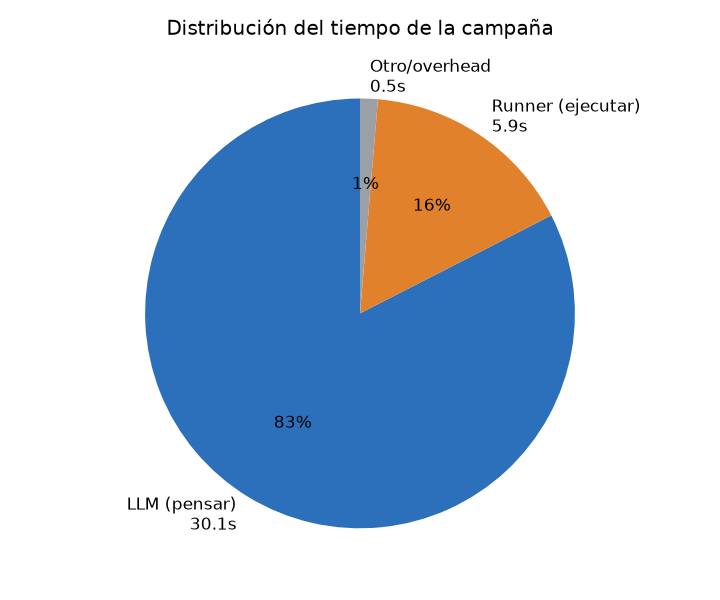
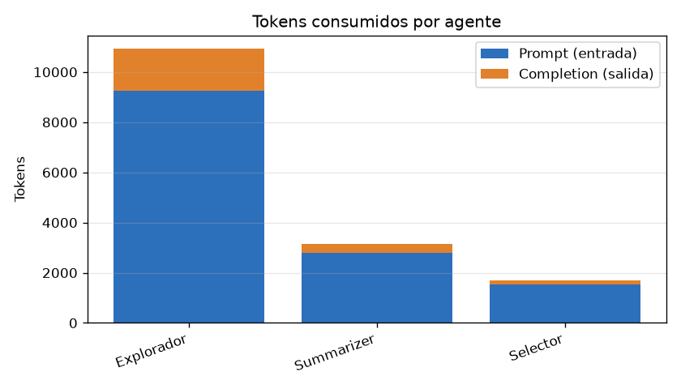
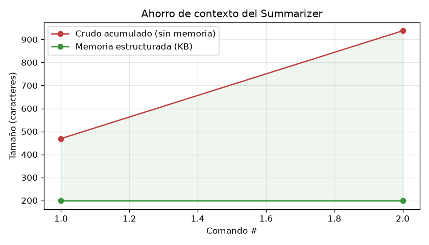
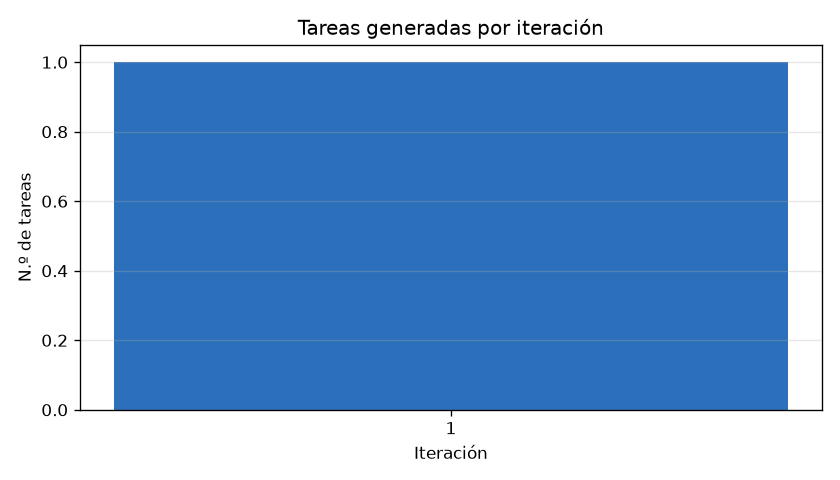
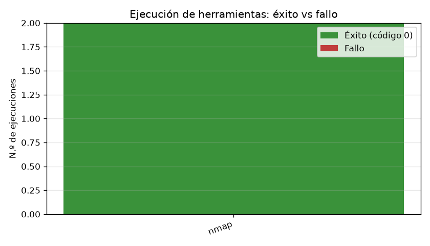

# Reporte de métricas — 2026-06-21 23:37:03

- **Objetivo (target):** `localhost`
- **Misión:** Estas en una maquina local, no hay puertos abiertos, tu unica tarea es ejecutar un nmap a los mil puertos mas comunes, si no sale nada abierto no importa.
- **Duración total:** 36s
- **Resultado:** ❌ No  ·  **Motivo de término:** `juez_aprobo_redundancia`

## Resumen ejecutivo

| Métrica | Valor |
|---|---|
| Iteraciones | 1 |
| Llamadas al LLM | 10 |
| Tokens totales | 15,778 (entrada 13,554 / salida 2,224) |
| Costo estimado LLM | ~$0.0061 USD |
| Tareas ejecutadas (runner) | 2 |
| Tasa de éxito de ejecución | 100% (2/2) |
| Tiempo en LLM / runner | 30s / 5s |

> El costo es **estimado** con tarifas orientativas de DeepSeek ($0.27/1M entrada, $1.1/1M salida); ajústalas en `metricas/collector.py`.

## Tiempo

## Consumo de LLM (tokens y costo)

| Agente | Llamadas | Prompt | Completion | Total |
|---|---|---|---|---|
| Explorador | 7 | 9,244 | 1,671 | 10,915 |
| Summarizer | 2 | 2,778 | 380 | 3,158 |
| Selector | 1 | 1,532 | 173 | 1,705 |

## Eficiencia del Summarizer (memoria estructurada)

Tras 2 comando(s): crudo acumulado **938** chars vs memoria **199** chars → compresión **4.7×** (~79% menos contexto que arrastrar todo el transcript).

## Iteraciones y decisiones (IA ↔ Juez)

| Iteración | Tareas | Decisión IA | Decisión Juez |
|---|---|---|---|
| 1 | 1 | terminar | aprueba |

**Acuerdo IA ↔ Juez** (cuándo coinciden y cuándo no):

| Situación | Veces |
|---|---|
| Ambos coinciden en terminar | 1 |
| Ambos coinciden en seguir | 0 |
| IA quería terminar pero el Juez insistió | 0 |
| IA quería seguir pero el Juez aprobó (cortó) | 0 |

## Ejecución de herramientas

| Herramienta | Ejecuciones | Éxito | Fallo | Latencia media |
|---|---|---|---|---|
| nmap | 2 | 2 | 0 | 2.9s |

## Cobertura final (KB del Explorador)

| Categoría | Cantidad |
|---|---|
| servicios | 0 |
| rutas | 0 |
| archivos | 0 |
| flags | 0 |
| hallazgos | 0 |
| pendientes | 0 |
| descartado | 1 |
